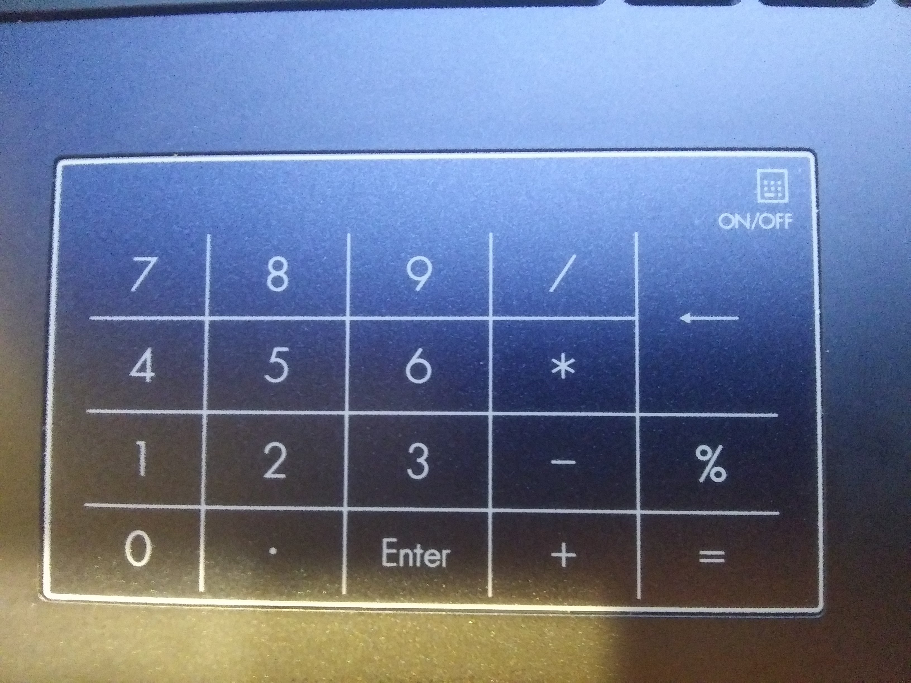

<!----------------------------------------------------------------------------->
<!-- Filename: README.md                                       /          \  -->
<!-- Project : Asus_L410M_Numpad                              |     ()     | -->
<!-- Date    : 02/17/2019                                     |            | -->
<!-- Author  : Dana Hynes                                     |   \____/   | -->
<!-- License : WTFPLv2                                         \          /  -->
<!----------------------------------------------------------------------------->

# Asus_L410M_Numpad
## "It mostly works™"

This small program runs at boot and gives you access to the numpad that
co-exists with the L410M trackpad. The code is largely inspired by
[this project](https://gitlab.com/Thraen/gx735_touchpad_numpad).



# Installing

To install, clone the git repo:
```bash
foo@bar:~$ cd ~/Downloads
foo@bar:~/Downloads$ git clone https://github.com/danahynes/Asus_L410M_Numpad
foo@bar:~/Downloads$ cd Asus_L410M_Numpad
```

Once you do that, you can install by:
```bash
foo@bar:~/Downloads/Asus_L410M_Numpad$ sudo ./install.sh
```
You can also download the
[latest release](http://github.com/danahynes/Asus_L410M_Numpad/releases/latest),
unzip it, and run the install.sh file from there.

# Uninstalling

To uninstall, go to the git directory and run:
```bash
foo@bar:~/Downloads/Asus_L410M_Numpad$ sudo ./uninstall.sh
```

or delete the files manually:
```bash
foo@bar:~$ sudo systemctl stop asus_l410m_numpad
foo@bar:~$ sudo systemctl disable asus_l410m_numpad

foo@bar:~$ sudo rm -rf /usr/bin/asus_l410m_numpad.py
foo@bar:~$ sudo rm -rf /lib/systemd/system/asus_l410m_numpad.service
foo@bar:~$ sudo rm -rf /var/log/asus_l410m_numpad.log
```

# Notes

If you are using Elementary OS 5, enable the Numlock indicator by going to
System Settings -> Keyboard -> Layout -> Show in panel -> Numlock and turning
it on.

To toggle the numpad mode, touch and hold on the toggle area for >
(TOGGLE_HOLD_TIME)[default = 2] seconds.

I have not been able to get the backlight for the numpad working yet. I thought
it would be mapped to the keyboard's NUMLOCK light, as it was in
[the original project](https://gitlab.com/Thraen/gx735_touchpad_numpad) (and
would be the most obvious way of using it -), even though my keyboard doesn't
actually have a NUMLOCK key. Testing shows the messages for the Numlock light
are being sent and tracked by the system, so it's not as simple as it should be
-(. More testing with a working (Windows) installation and a USB or i2c sniffer
is needed, but I'm WAAAAYYY too lazy to do that.

# Update

It seems that after a full Windows 10 install, with the proper drivers
installed, my numpad only has a little LED next to the toggle switch to indicate
if it is On or Off. I thought it illuminated the whole touchpad, though I could
be wrong as I didn't keep the original Windows on this laptop for more than a
few minutes (viva el GNU/Linux!). Either way it doesn't work yet and I am
working on it.

Also a lot of people on the interwebs complained about the Windows driver's
toggle switch being too finicky, so I added a timeout where you have to touch
and hold the toggle area for (TOGGLE_HOLD_TIME) seconds for the toggle to take
place. The default is two(2) seconds.

One finger tracking is complete, so that if you touch on a number and hold the
finger there, the number will repeat. If you move your finger, all input stops.
Multi-finger tracking is in the works, so you will be able to put two (or more)
fingers on the numpad and be able to scroll even if the numlock is on.


# TODO

1. track two (or more) fingers to scroll/gesture even when numpad is on (like
  the Windows driver does)
1. get backlight/numlock indicator working

# -)
